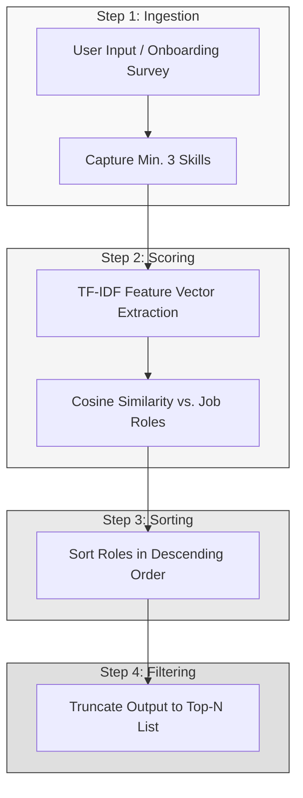

# Project 3: AI Recommendation Logic
## DecodeLabs Industrial Training Internship (Batch: 2026)

This repository contains the documentation and implementation pipeline for **Project 3: AI Recommendation Logic** (Week 3 Milestone).

---

## 📌 Project Overview
This project shifts the focus from passive classification to **Active Prediction** by building a personalization engine designed to solve "Choice Overload." Using **Content-Based Filtering**, the system connects users to items (specifically job roles/careers) by aligning user skills directly to item attributes.

### Core Objectives:
1. **Understand Recommendation Methodologies**: Compare Collaborative Filtering vs. Content-Based Filtering.
2. **Vector Space Mapping**: Represent qualitative skills and job requirements as mathematical vectors.
3. **TF-IDF Feature Weighting**: Implement Term Frequency-Inverse Document Frequency (TF-IDF) to prioritize specific, high-value keywords over generic terms.
4. **Cosine Similarity Metrics**: Measure the angular alignment of multi-dimensional user vectors against item vectors.
5. **The 4-Step Ranking Pipeline**: Implement Ingestion, Scoring, Sorting, and Filtering to output a ranked Top-N list.
6. **Mitigate the Cold Start Problem**: Develop onboarding and fallback solutions for new users.

---

## 🏛️ Pipeline Architecture

The recommendation engine implements a strict 4-step assembly line:



---

## 📐 Mathematical Mechanics

### 1. TF-IDF Weighting
To prevent high-frequency, generic words from dominating the similarity math, we use TF-IDF:
- **Term Frequency (TF)**: Importance of a term within a single profile/item.
  $$\text{TF} = \frac{\text{Count of term } t \text{ in document } d}{\text{Total terms in document } d}$$
- **Inverse Document Frequency (IDF)**: Penalizes generic terms that appear across many items in the dataset.
  $$\text{IDF} = \log\left(\frac{\text{Total Documents}}{\text{Documents with term } t}\right)$$

### 2. Cosine Similarity
Euclidean distance fails in unstructured text at scale because it is highly sensitive to document length (magnitude). **Cosine Similarity** measures the angle between vectors, ignoring magnitude:
$$\cos(\theta) = \frac{\mathbf{A} \cdot \mathbf{B}}{\|\mathbf{A}\| \|\mathbf{B}\|}$$
- **Range**: Since TF-IDF outputs non-negative values, the matching range sits between $0$ (orthogonal/no traits shared) and $1$ (aligned/identical direction).

---

## 💻 Capstone: Tech Stack Recommender

Your assignment is to build a **Tech Stack Recommender** using `raw_skills.csv`.

- **Input**: The user inputs three skills (e.g., `["Python", "Cloud Computing", "Automation"]`).
- **Process**: Load `raw_skills.csv` and treat job roles (Data Scientist, DevOps, Backend Developer, etc.) as the items. Calculate TF-IDF vectors.
- **Scoring & Output**: Compute cosine similarity scores and output the **Top 3 most relevant career paths**.

### Implementation Blueprint (Python & Scikit-Learn)

```python
import pandas as pd
from sklearn.feature_extraction.text import TfidfVectorizer
from sklearn.metrics.pairwise import cosine_similarity

# 1. Load Dataset (Treating job roles as documents containing skill lists)
# For demonstration, creating a mock DataFrame resembling raw_skills.csv
data = {
    'role': ['Data Scientist', 'DevOps Engineer', 'Backend Developer', 'Sys Admin'],
    'skills': [
        'python sql machine-learning statistics pandas data-analysis',
        'aws docker kubernetes linux bash ci-cd automation git',
        'java python sql apis spring-boot postgresql microservices git',
        'linux bash networking active-directory server-management virtualization'
    ]
}
df = pd.DataFrame(data)

# 2. Fit TF-IDF Vectorizer
vectorizer = TfidfVectorizer()
tfidf_matrix = vectorizer.fit_transform(df['skills'])

# 3. Simulate User Ingestion (Minimum of 3 inputs)
user_skills = ["python", "sql", "git"]
user_query = " ".join(user_skills)
user_vector = vectorizer.transform([user_query])

# 4. Score Similarity
similarity_scores = cosine_similarity(user_vector, tfidf_matrix).flatten()

# 5. Sort & Filter (Top-N)
df['score'] = similarity_scores
top_n = df.sort_values(by='score', ascending=False).head(3)

print("Top Career Recommendations:")
for idx, row in top_n.iterrows():
    print(f"- {row['role']}: Match Score: {row['score']:.4f}")
```

---

## ❄️ Bypassing the Cold Start Problem
- **User Cold Start** (No user history): Bypassed using **Onboarding Surveys** to build the initial vector, **Trending Fallbacks** (popular roles), or **Metadata Inference** (location/demographics).
- **Item Cold Start** (New career/role with no interaction history): Content-based filtering is inherently robust against this since new roles are indexed immediately by their skill attributes.
